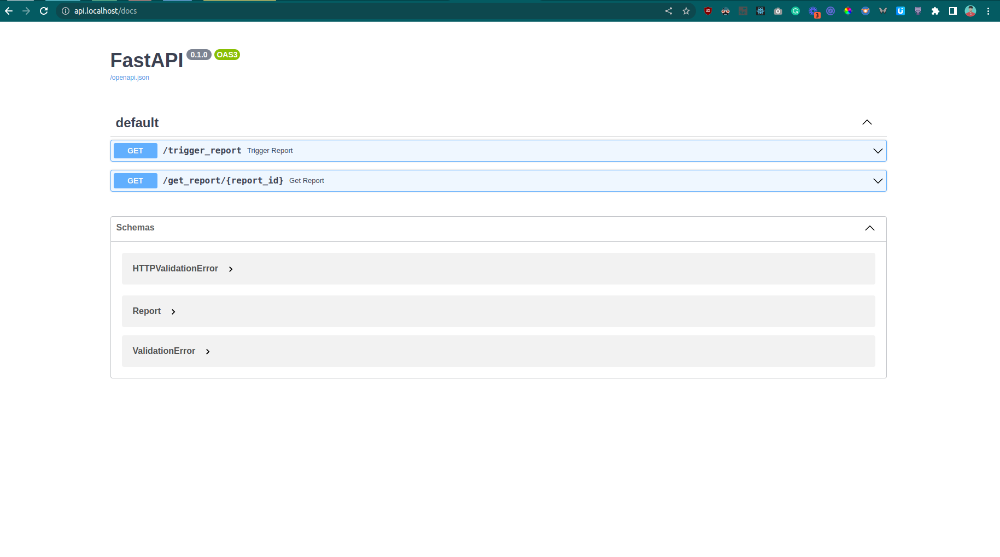
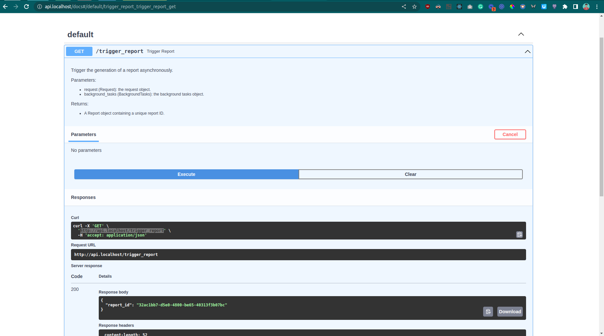
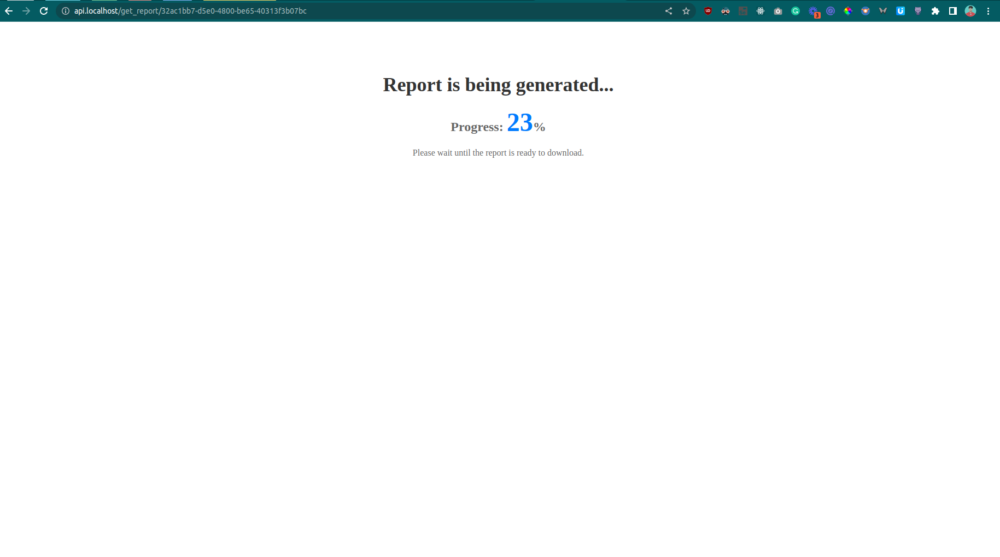
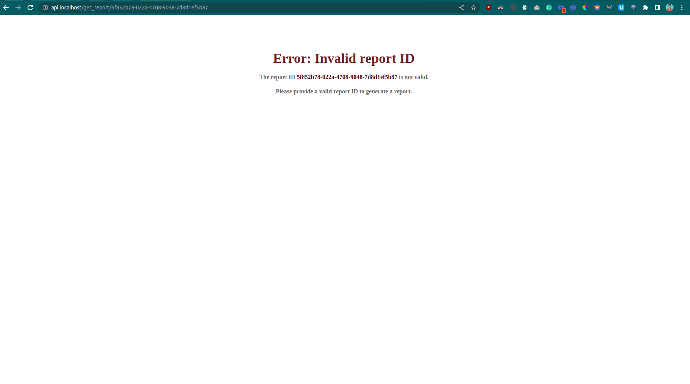

# special succotash

## HOW TO RUN

### Prerequisites

- Docker
- Docker-compose

### Setup Instructions

1. Clone the repository.
2. Unzip the data.zip file in the same directory as data.zip.
3. Change the environment flag in `docker-compose.yml` file for `IMPORT_CSV_TO_MONGODB` to true.
4. Open the terminal and run `docker-compose up --build` command to build the Docker containers.
5. Wait for around 3 minutes for all the CSV data to be imported into the MongoDB database.
6. server will be running on http://api.localhost  
7. on http://api.localhost/docs you can access swagger api
8. hit http://api.localhost/trigger_report for **report_id**
9. See progress http://api.localhost/get_report/report_id

Once the above steps are completed, the development environment for the project is set up and ready to run.

### Running the project

To run the project, execute the following command:

```shell
docker-compose up -build
```

or run

```shell
./run.sh # running docker-compose
./stop.sh # stopping  docker-compose
./database.sh # only run redis and Mongodb
```

To run the shell script, you may need to give it executable permission. This can be done using the `chmod` command

```shell
chmod u+x run.sh
```


Screenshots









### Tech stack

- python
  - (Fastapi, motor, aioredis, pandas, jinja2)
- Mongodb ( for database )
- Redis ( for cache )

### Problem Statement: Store Monitoring

The problem is to create a **backend API** that generates a report
on the **uptime** and **downtime** of restaurants during their business
hours based on three data sources: active/inactive store data,
business hours of stores, and time zones.

The report will be generated through two **APIs** that trigger
the report and retrieve its **status / progress** or **CSV output**.

### Technical Solution

- Calculates the start date and end dates for the report based on the NUMBER_OF_DAYS_TO_BE_REMOVED_FROM_TODAY, HOUR, and DAY constants.

- Retrieves the total number of documents in the STORE_TIMEZONE_DATA MongoDB collection, and calculates the number of batches to process based on the BATCH_SIZE constant.
- Iterates over each batch of documents in the STORE_TIMEZONE_DATA collection, and for each document:
  Extracts the store ID and timezone string.
- Localizes the start and end dates for the report based on the timezone string.
- Retrieves the store hours data for the store.
- Constructs a MongoDB aggregation pipeline to retrieve the store status history data for the specified time range and store hours.
- Executes the aggregation pipeline and retrieves the store status history data.
- Filters the store status history data based on the end date hour and end date day timestamps.
- Calculates the uptime and downtime durations for the last hour, last day, and last week based on the filtered store status history data.
- Constructs a report data dictionary containing the store ID and uptime/downtime data.
- Inserts the report data into a MongoDB collection named after the report ID.
